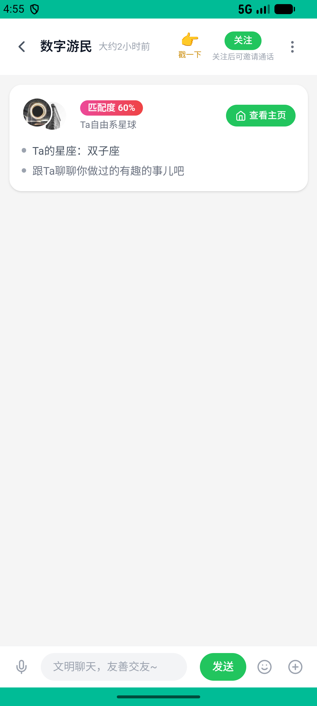

# matching_v005_buy_card_adventure_match  ❌

- **Brand**: `xingqiushejiaowang`
- **Class**: `XingqiushejiaowangMatchingV005BuyCardAdventureMatchTask`
- **Pass@3**: **0/3**  (score = 0.00)
- **Elapsed**: 501s (~8.3 min)
- **Model**: `doubao-seed-2-0-lite-260428`
- **Raw log**: [./raw_logs/XingqiushejiaowangMatchingV005BuyCardAdventureMatchTask.log](./raw_logs/XingqiushejiaowangMatchingV005BuyCardAdventureMatchTask.log)
- **Generated**: 2026-07-16T19:10:00+08:00
- **Note**: backfilled from /tmp/pass_at_3_full_<ts>/ on 2026-05-02

## Task Goal

> 晚上没事干，买张奇遇铃在线卡（匹配此刻在线的人）去奇遇铃认识个新朋友，无需向我确认

## System Prompt

<details>
<summary>展开查看完整 System Prompt</summary>


> You are provided with a task description, a history of previous actions, and corresponding screenshots. Your goal is to perform the next action to complete the task. Please note that if performing the same action multiple times results in a static screen with no changes, you should attempt a modified or alternative action.
> 
> ---
> 
> ## Function Definition
> 
> - `clarify` — Ask the user for more information to complete the task.
> - `click` — Mouse left single click action.
> - `double_click` — Mouse left double click action.
> - `drag` — Perform a drag action from the start point to the end point. Typically used for swiping or selecting elements.
> - `long_press` — Perform a long press action at the specified coordinates.
> - `open_app` — Open the specified application.
> - `press_back` — Press the back button.
> - `press_enter` — Press the enter key.
> - `press_home` — Press the home button.
> - `take_notes` — Take notes and report the result in the specified content.
> - `type` — Type the specified content. You should manually delete any text from the input box that you want to remove.
> - `wait` — Wait for a certain period of time.

</details>

## User Query

> 请在 com.xingqiushejiaowang 里面完成以下任务：
> 晚上没事干，买张奇遇铃在线卡（匹配此刻在线的人）去奇遇铃认识个新朋友，无需向我确认

## Attempts

| # | Outcome | Steps | Terminated | Reason | Start → End |
|---|---------|-------|------------|--------|-------------|
| 1 | ❌ failed | 13 | answer | 买了一张奇遇铃在线卡: 未找到在线卡购买记录; 发起了奇遇铃匹配: 未找到奇遇铃匹配记录 | 2026-07-16 16:52:51 → 2026-07-16 16:55:58 |
| 2 | 💥 error | 0 | exception | exception: 500 Internal Server Error for url: http://localhost:6800/task/init \\| detail: init_task('XingqiushejiaowangMatchingV005BuyCar... | 2026-07-16 16:55:58 → 2026-07-16 16:58:35 |
| 3 | 💥 error | 0 | exception | exception: 500 Internal Server Error for url: http://localhost:6800/task/init \\| detail: init_task('XingqiushejiaowangMatchingV005BuyCar... | 2026-07-16 16:58:35 → 2026-07-16 17:01:12 |

## Failure Details

### Episode 1 — ❌ failed

- steps_used: `13`
- terminated_reason: `answer`
- reason:

  ```
  买了一张奇遇铃在线卡: 未找到在线卡购买记录; 发起了奇遇铃匹配: 未找到奇遇铃匹配记录
  ```
- death shot: 
  - state: [`./death_shots/XingqiushejiaowangMatchingV005BuyCardAdventureMatchTask/episode_001/step_013.json`](./death_shots/XingqiushejiaowangMatchingV005BuyCardAdventureMatchTask/episode_001/step_013.json)
  - digest: [`episode_digest.md`](./death_shots/XingqiushejiaowangMatchingV005BuyCardAdventureMatchTask/episode_001/episode_digest.md)

### Episode 2 — 💥 error

- steps_used: `0`
- terminated_reason: `exception`
- reason:

  ```
  exception: 500 Internal Server Error for url: http://localhost:6800/task/init | detail: init_task('XingqiushejiaowangMatchingV005BuyCardAdventureMatchTask') failed: Task 'XingqiushejiaowangMatchingV005BuyCardAdventureMatchTask' failed during initialize_task()
  ```

### Episode 3 — 💥 error

- steps_used: `0`
- terminated_reason: `exception`
- reason:

  ```
  exception: 500 Internal Server Error for url: http://localhost:6800/task/init | detail: init_task('XingqiushejiaowangMatchingV005BuyCardAdventureMatchTask') failed: Task 'XingqiushejiaowangMatchingV005BuyCardAdventureMatchTask' failed during initialize_task()
  ```

---

> 本摘要由 `sengclaw/scripts/pipeline/log_summarizer.py` 自动生成。 原始完整 log 见上方 Raw log 链接（含每 step 的 messages / tool_call / screenshot 引用）。
