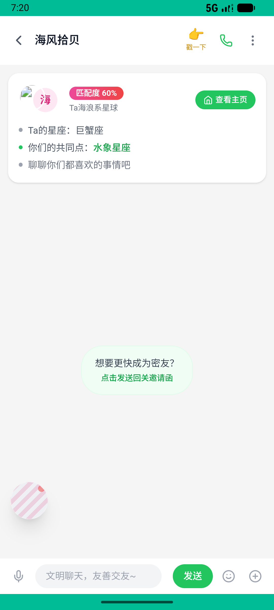
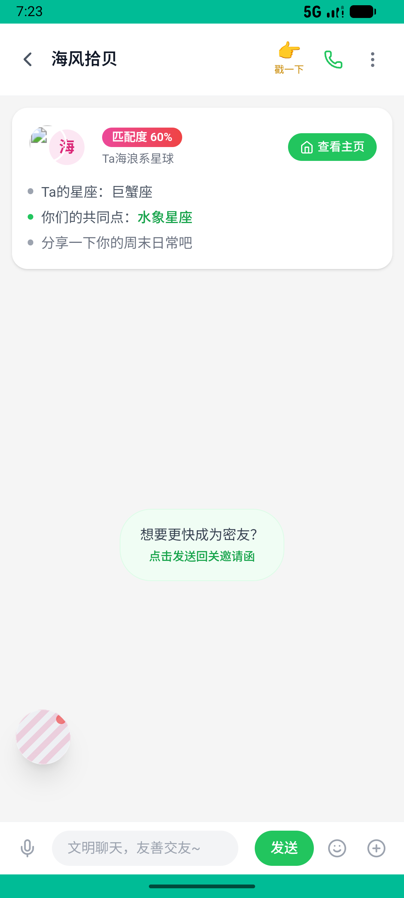

# journeys_v003_party_immersion_gift_follow_dm  ⚠️

- **Brand**: `xingqiushejiaowang`
- **Class**: `XingqiushejiaowangJourneysV003PartyImmersionGiftFollowDmTask`
- **Pass@3**: **1/3**  (score = 1.00)
- **Elapsed**: 578s (~9.6 min)
- **Model**: `doubao-seed-2-0-pro-260215`
- **Raw log**: [./raw_logs/XingqiushejiaowangJourneysV003PartyImmersionGiftFollowDmTask.log](./raw_logs/XingqiushejiaowangJourneysV003PartyImmersionGiftFollowDmTask.log)
- **Generated**: 2026-08-10T10:12:49+08:00
- **Note**: backfilled from /tmp/pass_at_3_full_<ts>/ on 2026-05-02

## Task Goal

> 首页推荐派对沉浸：发言、送礼、关注主持、退出后私聊

## System Prompt

<details>
<summary>展开查看完整 System Prompt</summary>


> You are provided with a task description, a history of previous actions, and corresponding screenshots. Your goal is to perform the next action to complete the task. Please note that if performing the same action multiple times results in a static screen with no changes, you should attempt a modified or alternative action.
> 
> ---
> 
> ## Function Definition
> 
> - `clarify` — Ask the user for more information to complete the task.
> - `click` — Mouse left single click action.
> - `double_click` — Mouse left double click action.
> - `drag` — Perform a drag action from the start point to the end point. Typically used for swiping or selecting elements.
> - `long_press` — Perform a long press action at the specified coordinates.
> - `open_app` — Open the specified application.
> - `press_back` — Press the back button.
> - `press_enter` — Press the enter key.
> - `press_home` — Press the home button.
> - `take_notes` — Take notes and report the result in the specified content.
> - `type` — Type the specified content. You should manually delete any text from the input box that you want to remove.
> - `wait` — Wait for a certain period of time.

</details>

## User Query

> 请在 com.xingqiushejiaowang 里面完成以下任务：
> 首页推荐派对沉浸：发言、送礼、关注主持、退出后私聊

## Attempts

| # | Outcome | Steps | Terminated | Reason | Start → End |
|---|---------|-------|------------|--------|-------------|
| 1 | ❌ failed | 24 | answer | 在派对里发了至少 1 条招呼消息: 招呼消息体不含问候字眼 Diff: @@ -1 +1 @@ -true +false ; 给主持人送了礼物: 尚未确定主持人（请先在某个派对里发出招呼消息）; 关注了主持人: 尚未确定主持人（请先在某个派对里发出招呼消息）; 与主持建立了... | 2026-08-09 19:17:14 → 2026-08-09 19:20:35 |
| 2 | ❌ failed | 20 | answer | 私聊里发出了至少 1 条消息: 私聊里 xiaoxing 没发消息 | 2026-08-09 19:20:35 → 2026-08-09 19:23:30 |
| 3 | ✅ passed | 23 | answer | – | 2026-08-09 19:23:30 → 2026-08-09 19:26:52 |

## Failure Details

### Episode 1 — ❌ failed

- steps_used: `24`
- terminated_reason: `answer`
- reason:

  ```
  在派对里发了至少 1 条招呼消息: 招呼消息体不含问候字眼
  Diff:
  @@ -1 +1 @@
  -true
  +false
  ; 给主持人送了礼物: 尚未确定主持人（请先在某个派对里发出招呼消息）; 关注了主持人: 尚未确定主持人（请先在某个派对里发出招呼消息）; 与主持建立了 dm 私聊: 尚未确定主持人（请先在某个派对里发出招呼消息）
  ```
- death shot: 
  - state: [`./death_shots/XingqiushejiaowangJourneysV003PartyImmersionGiftFollowDmTask/episode_001/step_024.json`](./death_shots/XingqiushejiaowangJourneysV003PartyImmersionGiftFollowDmTask/episode_001/step_024.json)
  - digest: [`episode_digest.md`](./death_shots/XingqiushejiaowangJourneysV003PartyImmersionGiftFollowDmTask/episode_001/episode_digest.md)

### Episode 2 — ❌ failed

- steps_used: `20`
- terminated_reason: `answer`
- reason:

  ```
  私聊里发出了至少 1 条消息: 私聊里 xiaoxing 没发消息
  ```
- death shot: 
  - state: [`./death_shots/XingqiushejiaowangJourneysV003PartyImmersionGiftFollowDmTask/episode_002/step_020.json`](./death_shots/XingqiushejiaowangJourneysV003PartyImmersionGiftFollowDmTask/episode_002/step_020.json)
  - digest: [`episode_digest.md`](./death_shots/XingqiushejiaowangJourneysV003PartyImmersionGiftFollowDmTask/episode_002/episode_digest.md)

---

> 本摘要由 `sengclaw/scripts/pipeline/log_summarizer.py` 自动生成。 原始完整 log 见上方 Raw log 链接（含每 step 的 messages / tool_call / screenshot 引用）。
